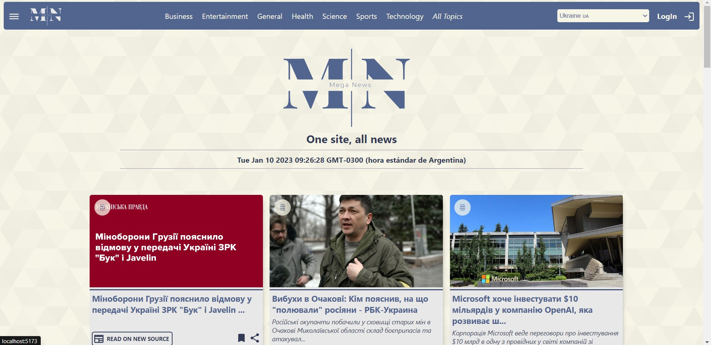

# MEGA News

## Descripción
MEGA News es un proyecto enfocado en la diversidad de fuentes, desde 2 puntos de vista: el país y la fuente de la noticia.

Basado, principalmente, en https://newsapi.org/, se aprovecha la diversidad y flexibilidad de dicha API para lograr este objetivo; haciendo uso de los diversos filtros con el fin de otorgarle al usuario exactamente lo que busca.

Cabe resaltar que se trabajó con la versión "Developer" de la API, la que, como es lógico, tiene ciertas limitaciones.

A pesar de esto la aplicación es 100% funcional en las características planteadas inicialmente, ademas de estar abierta a la incorporación de nuevas actualizaciones y funciones.

Esperando que encuentre constructiva e interesante su visita, agradezco enormenmente su interés en el proyecto.

## Instalación y funcionamiento
El proyecto cuenta con 2 carpetas en su raíz:
 - /client: para el frontend.
 - /server: para el backend.
 
/client (comandos):
- *npm install* para la instalación de librerias
- *npm run dev* iniciar la aplicación en modo desarrollador

/server (comandos):
- *npm install* para la instalación de librerias
- *npm start* levantar el servidor

Por favor asegurece revisar el archivo .env.example.
Es necesaria una cuenta en https://newsapi.org/ para obtener una apiKEY propia.

## Descripción técnica
Concebido como un proyecto FullStack, MEGA News cuenta con un Frontend y un Backend independientes y funcionales en si mismos.
Motivo esta decision la idea de plantear una aplicación web que pueda crecer y abarcar nuevas funcionalidades y características, facilitando el desarrollo de las mismas.
Pasando a las tecnologías específicas, podemos nombrar las siguientes:

**Backend**
 - Express JS
 - MongoDB Atlas (la base de datos se encuentra conectada y lista pero, actualmente, sin ninguna funcionalidad)
 - Node JS

**Frontend**
 - React
 - Redux toolkit
 - Vite
 - Material UI(icons sobre todo)
 - Vanilla CSS
 
Ademas se utilizaron las siguientes **librerias**:
 - axios
 - body-parse
 - cors
 - dotenv
 - mongoose
 - morgan
 - nodemon

 

## Estado actual
En este momento la aplicación se encuentra en su versión 0.0.20. (Todo el historial de tags se encuentra disponible para su revisión)
La presentación de la información gira alrededor de 2 parámetros principales: **country**(país) y **topic**(tópico).

Cada uno de estos parámetros filtra las noticias que se van a presentar en la ruta "**/home**", y pueden combinarse entre ellos. Por ejemplo, revisar noticias de "Argentina" (**country**) y "Deporte" (**topic**); o, simplemente revisar el tópico "deportes" en forma general.

Una vez filtrada y presentada la información es posible acceder al detalle de una noticia en la ruta "**/:title**", haciendo click en el título de la misma. Una vez terminada la lectura es posible regresar a "**/home**" haciendo click en el logo de la web.
Los estilos y la paleta de colores fueron diseñados específicamente para esta aplicación, hechos en CSS puro. La nomenclatura de las clases son uno de los puntos a corregir.

El **footer** se utiliza para desplegar la información de portafolio.
Con esto la aplicación cumple con sus objetivos básicos y queda abierta a futuras actualizaciones y mejoras.

## Futuras características
 - Display de cotización de monedas extranjeras. El mismo estará estrechamente relacionado a la variable "**country**".
 - Añadir 3 o 4 modelos extras de grids, que permitan añadir variedad al diseño del "**/home**".
 - Dar funcionalidad a los botones "**share**", tanto en la ruta "**/:title**" (detalle) como dentro de las tarjetas en la ruta "**/home**".
 - Trabajar el responsive.
 - Implementar Dark Mode.
 
Cualquier característica extra, con la que desees colaborar, sera bien recibida.

## Detalle por versiones

v0.0.13

Finalizado el diseño desde cero de las tarjetas básicas del Grid principal. Algunas de los elementos destacables del diseño son:

> Diseño armónico que permite una distribucion pareja de las tarjetas, con el mismo tamaño en cada una de ellas.

> Inserción de un boton especifico para redirigir al usuario a la página fuente de la noticia.

> Debajo del boton arriba mencionado, se incluye una descripcion clara de dicha fuente.

> Incorporacion de 3 botones (por el momento sin funcionalidad): detalles(arriba a la izquierda de la imagen), bookmark(guardado de la noticia) y compartir.

> Se añadieron elementos estéticos para incentivar al usuario a pinchar en la noticia y leerla dentro de la misma página(funcion todavia no implementada). Dicha funcion se ejecutara al hacer click sobre la imagen o sobre el título de la noticia.

  

v0.0.15

> Finalizado el diseño de la ruta '/:title', que muestra una noticia en detalle. Debido a limitaciones de API el texto completo de la noticia no es accesible.

> Se diseño un header con el logo y algunos elementos esteticos.

> Todavia no se realizo la conexion con el backend. Se "hardcodeo" un JSON con un array de 20 noticias, con el fin de realizar las pruebas sin preocuparse por el limite de llamadas.

  

v0.0.16

> Finalizada la parte estetica del Footer.

  

v0.0.17

> Agregados los enlaces del footer

> Creados los componentes About, AboutMe y Form, y conectados al footer.

  

v0.0.19

> Terminado el formulario y conectado exitosamente el submit del mismo(reenvia la informacion del form al email del administrador), incluido estructura y estilos.

v0.0.20

> Actualizado y terminado el componente About.
> Conectado nuevamente el Backend
> Completado y actualizado el README.md